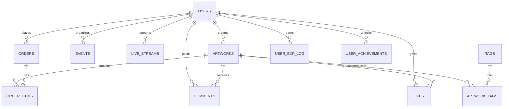

# 03_データベース設計書

このドキュメントは `00_統合要件定義書.md` に基づき、Eldonia-Nex プラットフォーム向けのデータベース設計案をまとめたものです。対象 DB は PostgreSQL を想定しています。

## 目次

1. 概要
2. ERD（概観）
3. 主要テーブル定義（抜粋）
4. インデックスとクエリ最適化
5. パーティショニング戦略
6. レプリケーションとバックアップ
7. マイグレーションと運用注意点

## 1. 概要

- 対象: ユーザー、作品（artworks）、注文（orders）、支払い、ライブ／イベント、コメント、いいね等のソーシャル機能。
- 要件のポイント:
  - 多言語・多通貨対応
  - 大量の静的メタデータと高頻度アクセス
  - 可用性・バックアップ・スケーラビリティ

設計方針: 正規化を基礎に、読み取り負荷が高い箇所はインデックス・マテビュー・キャッシュを併用します。

## 2. ERD（概観）



## 3. 主要テーブル定義（抜粋）

### users

- id: BIGSERIAL PRIMARY KEY
- username: VARCHAR(50) UNIQUE NOT NULL
- email: VARCHAR(255) UNIQUE NOT NULL
- password_hash: VARCHAR(255) NOT NULL
- display_name: VARCHAR(100)
- bio: TEXT
- avatar_url: VARCHAR(500)
- subscription_plan: VARCHAR(20) NOT NULL DEFAULT 'free'
- total_exp: BIGINT NOT NULL DEFAULT 0
- current_level: INTEGER NOT NULL DEFAULT 1
- is_active: BOOLEAN NOT NULL DEFAULT TRUE
- created_at: timestamptz NOT NULL DEFAULT now()
- updated_at: timestamptz NOT NULL DEFAULT now()

インデックス例:

- UNIQUE(email)
- UNIQUE(username)
- INDEX(subscription_plan)

DDL 例:

```sql
CREATE TABLE users (
  id BIGSERIAL PRIMARY KEY,
  username VARCHAR(50) UNIQUE NOT NULL,
  email VARCHAR(255) UNIQUE NOT NULL,
  password_hash VARCHAR(255) NOT NULL,
  display_name VARCHAR(100),
  bio TEXT,
  avatar_url VARCHAR(500),
  subscription_plan VARCHAR(20) NOT NULL DEFAULT 'free',
  total_exp BIGINT NOT NULL DEFAULT 0,
  current_level INTEGER NOT NULL DEFAULT 1,
  is_active BOOLEAN NOT NULL DEFAULT TRUE,
  created_at timestamptz NOT NULL DEFAULT now(),
  updated_at timestamptz NOT NULL DEFAULT now()
);
CREATE INDEX idx_users_subscription_plan ON users(subscription_plan);
```

### artworks

- id: BIGSERIAL PRIMARY KEY
- creator_id: BIGINT NOT NULL REFERENCES users(id) ON DELETE CASCADE
- title: VARCHAR(255) NOT NULL
- description: TEXT
- price: NUMERIC(10,2) NOT NULL DEFAULT 0
- is_free: BOOLEAN NOT NULL DEFAULT TRUE
- status: VARCHAR(20) NOT NULL DEFAULT 'published'
- file_url: VARCHAR(1000) NOT NULL
- view_count: BIGINT NOT NULL DEFAULT 0
- like_count: INTEGER NOT NULL DEFAULT 0
- created_at: timestamptz NOT NULL DEFAULT now()
- updated_at: timestamptz NOT NULL DEFAULT now()

検索戦略:

- GIN + tsvector を検討
- INDEX(status), INDEX(price), INDEX(created_at)

DDL 例:

```sql
CREATE TABLE artworks (
  id BIGSERIAL PRIMARY KEY,
  creator_id BIGINT NOT NULL REFERENCES users(id) ON DELETE CASCADE,
  title VARCHAR(255) NOT NULL,
  description TEXT,
  price NUMERIC(10,2) NOT NULL DEFAULT 0,
  is_free BOOLEAN NOT NULL DEFAULT TRUE,
  status VARCHAR(20) NOT NULL DEFAULT 'published',
  file_url VARCHAR(1000) NOT NULL,
  view_count BIGSERIAL NOT NULL DEFAULT 0,
  like_count INTEGER NOT NULL DEFAULT 0,
  created_at timestamptz NOT NULL DEFAULT now(),
  updated_at timestamptz NOT NULL DEFAULT now()
);
ALTER TABLE artworks ADD COLUMN IF NOT EXISTS search_vector tsvector;
CREATE INDEX IF NOT EXISTS idx_artworks_search ON artworks USING GIN(search_vector);
```

## 4. インデックスとクエリ最適化

- 読み取りが多い列に対して B-tree、全文検索は GIN+tsvector を推奨します。
- 高頻度更新列はアプリ側でバッチ集計→更新する方針が有効です。

## 5. パーティショニング戦略

- コメントやログは月次 RANGE パーティションを検討してください。

## 6. レプリケーションとバックアップ

- Primary/Replica を利用し、WAL アーカイブで PITR を実装してください。

## 7. マイグレーションと運用注意点

1. 新カラムは一度 NULL 許容で追加してバックフィルを行う。
2. 大きなインデックスは CONCURRENTLY を使用して作成する。

---

更新履歴:

- 2025-11-11: 初版（整理）
