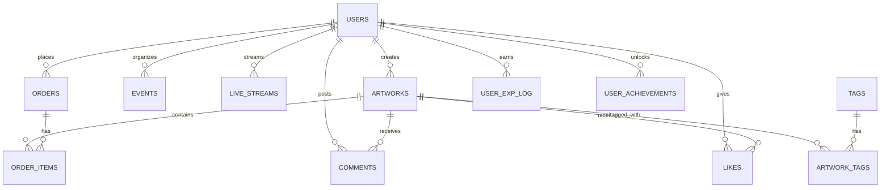

# 03_データベース設計書（修正版）

このドキュメントは `00_統合要件定義書.md` に基づき、Eldonia-Nex のデータベース設計（PostgreSQL 想定）を整理したものです。目的は ERD、代表テーブルの DDL サンプル、インデックス方針、運用時の注意点を実装チームに分かりやすく伝えることです。

## 目次

- 概要
- ERD（概観）
- 主要テーブル定義（抜粋）
- インデックスとクエリ最適化
- パーティショニング・シャーディング戦略
- レプリケーション・バックアップ
- マイグレーションと運用注意点

## 概要

- 対象: ユーザー、作品、注文、支払い、ライブ／イベント、コメント、いいね等。
- 要件要約:
  - 多言語・多通貨対応
  - 決済（Stripe）対応
  - 可用性・バックアップ・スケーラビリティ

## ERD（概観）



## 主要テーブル定義（抜粋）

### users（抜粋）

- id: BIGSERIAL PRIMARY KEY
- username: VARCHAR(50) UNIQUE NOT NULL
- email: VARCHAR(255) UNIQUE NOT NULL
- password_hash: VARCHAR(255) NOT NULL
- display_name: VARCHAR(100)
- total_exp: BIGINT NOT NULL DEFAULT 0
- current_level: INTEGER NOT NULL DEFAULT 1
- is_active: BOOLEAN NOT NULL DEFAULT TRUE
- created_at / updated_at

DDL 例:

```sql
CREATE TABLE users (
  id BIGSERIAL PRIMARY KEY,
  username VARCHAR(50) UNIQUE NOT NULL,
  email VARCHAR(255) UNIQUE NOT NULL,
  password_hash VARCHAR(255) NOT NULL,
  total_exp BIGINT NOT NULL DEFAULT 0,
  current_level INTEGER NOT NULL DEFAULT 1,
  is_active BOOLEAN NOT NULL DEFAULT TRUE,
  created_at timestamptz NOT NULL DEFAULT now(),
  updated_at timestamptz NOT NULL DEFAULT now()
);
CREATE INDEX idx_users_subscription_plan ON users(subscription_plan);
```

### artworks（抜粋）

- id, creator_id (FK users), title, description, price, status, file_url, view_count, like_count

DDL 例（抜粋）:

```sql
CREATE TABLE artworks (
  id BIGSERIAL PRIMARY KEY,
  creator_id BIGINT NOT NULL REFERENCES users(id) ON DELETE CASCADE,
  title VARCHAR(255) NOT NULL,
  description TEXT,
  price NUMERIC(10,2) NOT NULL DEFAULT 0,
  status VARCHAR(20) NOT NULL DEFAULT 'published',
  file_url VARCHAR(1000) NOT NULL,
  view_count BIGINT NOT NULL DEFAULT 0,
  like_count INTEGER NOT NULL DEFAULT 0,
  created_at timestamptz NOT NULL DEFAULT now(),
  updated_at timestamptz NOT NULL DEFAULT now()
);
ALTER TABLE artworks ADD COLUMN IF NOT EXISTS search_vector tsvector;
CREATE INDEX IF NOT EXISTS idx_artworks_search ON artworks USING GIN(search_vector);
```

## インデックスとクエリ最適化

- 読み取り重視: B-tree
- 全文検索: GIN + tsvector
- 高頻度更新: アプリ側で集計→バッチ更新を検討

## パーティショニング

- コメントやログは月次 RANGE パーティションを推奨

## レプリケーション・バックアップ

- Primary/Replica 構成、WAL アーカイブで PITR を実装
- バックアップは別リージョンのストレージへ暗号化して保管

## マイグレーション運用

1. 新カラムを NULL 許容で追加
2. バックフィル
3. NOT NULL 制約を追加

---

更新履歴:

- 2025-11-11: 修正版を作成（Markdown 警告を整理）

