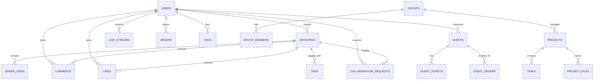
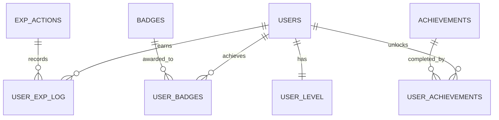
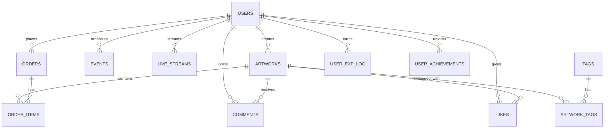

# 03_データベース設計書

このドキュメントは `00_統合要件定義書.md` の要件を踏まえ、Eldonia-Nex プラットフォーム向けのデータベース設計をまとめたものです。
対象DBは PostgreSQL 17（推奨）を想定します。主な内容：ERD、主要テーブル定義、DDLサンプル、インデックス設計、パーティショニング・レプリケーション方針、バックアップ・運用指針、スケーリング案。

## 目次
- 概要
- ERD（概観）
- 主要テーブル定義（カラム／型／制約）
- インデックスとクエリ最適化
- パーティショニング・シャーディング戦略
- レプリケーション・可用性
- バックアップ・リカバリ
- マイグレーションと運用注意点

## 概要
- 対象: ユーザー、作品（artworks）、注文（orders）、支払い、ライブ／イベント、コメントやいいね等のソーシャル機能をサポートするスキーマ。
- 要件要約（`00_統合要件定義書.md`より）:
    - 多言語・多通貨対応、決済（Stripe）対応
    - 大量の静的メタデータ（作品、ファイル）と高頻度のアクセス（いいね、閲覧、ライブ視聴）
    - 高可用性・バックアップ・スケーラビリティ

設計方針：正規化を基本としつつ、アクセス集中テーブルには適切なインデックス・マテリアライズドビュー・キャッシュ（Redis）を併用する。

## ERD（概観）

```mermaid
erDiagram
        USERS ||--o{ ARTWORKS : creates
        USERS ||--o{ EVENTS : organizes
        USERS ||--o{ LIVE_STREAMS : streams
        USERS ||--o{ ORDERS : places
        USERS ||--o{ COMMENTS : posts
        USERS ||--o{ LIKES : gives
        ARTWORKS ||--o{ ORDER_ITEMS : contains
        ARTWORKS ||--o{ COMMENTS : receives
        ARTWORKS ||--o{ LIKES : receives
        ARTWORKS ||--o{ ARTWORK_TAGS : tagged_with
        ---
        title: "03_データベース設計書"
        updated: 2025-11-11
        ---

        # 03_データベース設計書

        このドキュメントは `00_統合要件定義書.md` の要件を踏まえ、Eldonia-Nex プラットフォーム向けのデータベース設計をまとめたものです。
        対象 DB は PostgreSQL（推奨）を想定します。主な内容：ERD、主要テーブル定義、DDL サンプル、インデックス設計、パーティショニング、レプリケーション・バックアップ方針、マイグレーション運用指針。

        ## 目次

        ---
        title: "03_データベース設計書"
        updated: 2025-11-11
        ---

        # 03_データベース設計書

        このドキュメントは `00_統合要件定義書.md` の要件を踏まえ、Eldonia-Nex プラットフォーム向けのデータベース設計をまとめたものです。対象 DB は PostgreSQL（推奨）を想定します。

        ## 目次

        - 概要
        - ERD（概観）
        - 主要テーブル定義（抜粋）
        - インデックスとクエリ最適化
        ---
        title: "03_データベース設計書"
        updated: 2025-11-11
        ---

        # 03_データベース設計書

        このドキュメントは `00_統合要件定義書.md` の要件を踏まえ、Eldonia-Nex プラットフォーム向けのデータベース設計をまとめたものです。対象 DB は PostgreSQL（推奨）を想定します。

        ## 目次

        - 概要
        - ERD（概観）
        - 主要テーブル定義（抜粋）
        - インデックスとクエリ最適化
        - パーティショニング・シャーディング戦略
        - レプリケーション・バックアップ
        - マイグレーションと運用注意点

        ## 概要

        - 対象: ユーザー、作品（artworks）、注文（orders）、支払い、ライブ／イベント、コメント、いいね等のソーシャル機能。
        - 要件要約（`00_統合要件定義書.md` より）:
            - 多言語・多通貨対応、決済（Stripe）対応
            - 大量の静的メタデータと高頻度アクセス
            - 可用性・バックアップ・スケーラビリティ

        設計方針：正規化を基本としつつ、アクセス集中テーブルにはインデックス・マテリアライズドビュー・キャッシュ（Redis）を併用します。

        ## ERD（概観）

        ```mermaid
        erDiagram
            USERS ||--o{ ARTWORKS : creates
            USERS ||--o{ EVENTS : organizes
            USERS ||--o{ LIVE_STREAMS : streams
            USERS ||--o{ ORDERS : places
            USERS ||--o{ COMMENTS : posts
            USERS ||--o{ LIKES : gives
            ARTWORKS ||--o{ ORDER_ITEMS : contains
            ARTWORKS ||--o{ COMMENTS : receives
            ARTWORKS ||--o{ LIKES : receives
            ARTWORKS ||--o{ ARTWORK_TAGS : tagged_with
            TAGS ||--o{ ARTWORK_TAGS : has
            ORDERS ||--o{ ORDER_ITEMS : has
            USERS ||--o{ USER_EXP_LOG : earns
            USERS ||--o{ USER_ACHIEVEMENTS : unlocks
        ```

        （上図は概観です。詳細は ER 図ツールで補完してください。）

        ## 主要テーブル定義（抜粋）

        以下は代表テーブルの抜粋です。実装時はマイグレーションと既存データを考慮してください。

        ### users

        - 目的: 認証・プロフィール・プランなどのユーザ情報。

        代表カラム（Postgres 型）:

        - id: BIGSERIAL PRIMARY KEY
        - username: VARCHAR(50) UNIQUE NOT NULL
        - email: VARCHAR(255) UNIQUE NOT NULL
        - password_hash: VARCHAR(255) NOT NULL
        - display_name: VARCHAR(100)
        - bio: TEXT
        - avatar_url: VARCHAR(500)
        - subscription_plan: VARCHAR(20) NOT NULL DEFAULT 'free'
        - total_exp: BIGINT NOT NULL DEFAULT 0
        - current_level: INTEGER NOT NULL DEFAULT 1
        - is_active: BOOLEAN NOT NULL DEFAULT TRUE
        - created_at: TIMESTAMP WITH TIME ZONE NOT NULL DEFAULT now()
        - updated_at: TIMESTAMP WITH TIME ZONE NOT NULL DEFAULT now()

        主要インデックス:

        - UNIQUE(email), UNIQUE(username)
        - INDEX(subscription_plan)

        DDL サンプル:

        ```sql
        CREATE TABLE users (
            id BIGSERIAL PRIMARY KEY,
            username VARCHAR(50) UNIQUE NOT NULL,
            email VARCHAR(255) UNIQUE NOT NULL,
            password_hash VARCHAR(255) NOT NULL,
            display_name VARCHAR(100),
            bio TEXT,
            avatar_url VARCHAR(500),
            subscription_plan VARCHAR(20) NOT NULL DEFAULT 'free',
            total_exp BIGINT NOT NULL DEFAULT 0,
            current_level INTEGER NOT NULL DEFAULT 1,
            is_active BOOLEAN NOT NULL DEFAULT TRUE,
            created_at timestamptz NOT NULL DEFAULT now(),
            updated_at timestamptz NOT NULL DEFAULT now()
        );
        CREATE INDEX idx_users_subscription_plan ON users(subscription_plan);
        ```

        ### artworks

        - 目的: 作品メタデータ（ファイルはオブジェクトストレージに格納）。

        代表カラム:

        - id: BIGSERIAL PRIMARY KEY
        - creator_id: BIGINT NOT NULL REFERENCES users(id) ON DELETE CASCADE
        - title: VARCHAR(255) NOT NULL
        - description: TEXT
        - price: NUMERIC(10,2) NOT NULL DEFAULT 0
        - is_free: BOOLEAN NOT NULL DEFAULT TRUE
        - status: VARCHAR(20) NOT NULL DEFAULT 'published'
        - file_url: VARCHAR(1000) NOT NULL
        - view_count: BIGINT NOT NULL DEFAULT 0
        - like_count: INTEGER NOT NULL DEFAULT 0
        - created_at: timestamptz NOT NULL DEFAULT now()
        - updated_at: timestamptz NOT NULL DEFAULT now()

        インデックス / 検索戦略:

        - GIN + tsvector（日本語解析）を検討
        - INDEX(status), INDEX(price), INDEX(created_at)

        DDL サンプル（抜粋）:

        ```sql
        CREATE TABLE artworks (
            id BIGSERIAL PRIMARY KEY,
            creator_id BIGINT NOT NULL REFERENCES users(id) ON DELETE CASCADE,
            title VARCHAR(255) NOT NULL,
            description TEXT,
            price NUMERIC(10,2) NOT NULL DEFAULT 0,
            is_free BOOLEAN NOT NULL DEFAULT TRUE,
            status VARCHAR(20) NOT NULL DEFAULT 'published',
            file_url VARCHAR(1000) NOT NULL,
            view_count BIGINT NOT NULL DEFAULT 0,
            like_count INTEGER NOT NULL DEFAULT 0,
            created_at timestamptz NOT NULL DEFAULT now(),
            updated_at timestamptz NOT NULL DEFAULT now()
        );
        ALTER TABLE artworks ADD COLUMN IF NOT EXISTS search_vector tsvector;
        CREATE INDEX IF NOT EXISTS idx_artworks_search ON artworks USING GIN(search_vector);
        ```

        ## インデックスとクエリ最適化

        - 読み取りが多い列は B-tree、全文検索は GIN + tsvector を優先します。
        - 高頻度更新列（view_count 等）はアプリ側で集計して定期更新することで bloat を抑制します。

        ## パーティショニング・シャーディング戦略

        - コメントやログ等は月次 RANGE パーティションを検討してください。
        - orders は created_at による RANGE パーティション化を検討し、古いパーティションをアーカイブします。

        ## レプリケーション・バックアップ

        - Primary/Replica 構成、WAL アーカイブで PITR を実装します。
        - バックアップは別リージョンのオブジェクトストレージへ暗号化して保管してください。

        ## マイグレーションと運用注意点

        1. 大きな変更は段階的に実施：NULL 許容 → バックフィル → 制約追加
        2. インデックス作成は CONCURRENTLY を活用

        ---

        更新履歴:

        - 2025-11-11: 初版（整理版）


## 付録: よく使うDDL / ユーティリティ

1) `search_vector` 用トリガ関数（例）

```sql
CREATE FUNCTION artworks_search_vector_update() RETURNS trigger AS $$
begin
    new.search_vector := to_tsvector('japanese', coalesce(new.title,'') || ' ' || coalesce(new.description,''));
    return new;
end
$$ LANGUAGE plpgsql;

CREATE TRIGGER trg_artworks_search_vector BEFORE INSERT OR UPDATE
    ON artworks FOR EACH ROW EXECUTE FUNCTION artworks_search_vector_update();
```

2) `comments` のレンジパーティション（例）

```sql
CREATE TABLE comments (
    id BIGSERIAL PRIMARY KEY,
    artwork_id BIGINT NOT NULL REFERENCES artworks(id),
    user_id BIGINT NOT NULL REFERENCES users(id),
    content TEXT NOT NULL,
    created_at timestamptz NOT NULL DEFAULT now()
) PARTITION BY RANGE (created_at);

-- 月次パーティションの追加例
CREATE TABLE comments_2025_11 PARTITION OF comments
    FOR VALUES FROM ('2025-11-01') TO ('2025-12-01');
```

---
## まとめ
- 本設計は `00_統合要件定義書.md` に基づき、可用性・スケーラビリティ・運用性を重視した Postgres ベースの設計案です。
- 実装時は実際のトラフィック・クエリパターンを観測し、インデックスやパーティショニングのチューニングを行ってください。

---
更新履歴:
- 2025-11-11: ドキュメント初版（統合要件を反映した再作成）

# Eldonia-Nex データベース設計書

## 1. ER図（Entity Relationship Diagram）

### 1.1 主要エンティティ関連図



### 1.2 ゲーミフィケーション関連図



---

## 2. テーブル定義

### 2.1 ユーザー関連テーブル

#### 2.1.1 users（ユーザー）

```sql
CREATE TABLE users (
    id BIGSERIAL PRIMARY KEY,
    username VARCHAR(50) UNIQUE NOT NULL,
    email VARCHAR(255) UNIQUE NOT NULL,
    password_hash VARCHAR(255) NOT NULL,
    display_name VARCHAR(100),
    bio TEXT,
    avatar_url VARCHAR(500),
    website_url VARCHAR(500),
    location VARCHAR(100),
    birth_date DATE,
    gender CHAR(1) CHECK (gender IN ('M', 'F', 'O')),
    phone_number VARCHAR(20),
    is_email_verified BOOLEAN DEFAULT FALSE,
    is_phone_verified BOOLEAN DEFAULT FALSE,
    account_status VARCHAR(20) DEFAULT 'active'
        CHECK (account_status IN ('active', 'suspended', 'deleted')),
    subscription_type VARCHAR(20) DEFAULT 'free'
        CHECK (subscription_type IN ('free', 'premium', 'pro')),
    total_exp BIGINT DEFAULT 0,
    current_level INTEGER DEFAULT 1,
    fan_count INTEGER DEFAULT 0,
    fanning_count INTEGER DEFAULT 0,
    created_at TIMESTAMP WITH TIME ZONE DEFAULT CURRENT_TIMESTAMP,
    updated_at TIMESTAMP WITH TIME ZONE DEFAULT CURRENT_TIMESTAMP
);

CREATE INDEX idx_users_username ON users(username);
CREATE INDEX idx_users_email ON users(email);
CREATE INDEX idx_users_level ON users(current_level);
CREATE INDEX idx_users_exp ON users(total_exp);
```
---
title: "03_データベース設計書"
updated: 2025-11-11
---
# 03_データベース設計書

このドキュメントは `00_統合要件定義書.md` の要件を踏まえ、Eldonia-Nex プラットフォーム向けのデータベース設計をまとめたものです。
対象DBは PostgreSQL 17（推奨）を想定します。主な内容：ERD、主要テーブル定義、DDLサンプル、インデックス設計、パーティショニング・レプリケーション方針、バックアップ・運用指針、スケーリング案。

## 目次

- 概要
- ERD（概観）
- 主要テーブル定義（カラム／型／制約）
- インデックスとクエリ最適化
- パーティショニング・シャーディング戦略
- レプリケーション・可用性
- バックアップ・リカバリ
- マイグレーションと運用注意点

## 概要

- 対象: ユーザー、作品（artworks）、注文（orders）、支払い、ライブ／イベント、コメントやいいね等のソーシャル機能をサポートするスキーマ。
- 要件要約（`00_統合要件定義書.md`より）:
  - 多言語・多通貨対応、決済（Stripe）対応
  - 大量の静的メタデータ（作品、ファイル）と高頻度のアクセス（いいね、閲覧、ライブ視聴）
  - 高可用性・バックアップ・スケーラビリティ

設計方針：正規化を基本としつつ、アクセス集中テーブルには適切なインデックス・マテリアライズドビュー・キャッシュ（Redis）を併用する。

## ERD（概観）



（図は主要エンティティと関係を示します。実運用時は ER 図ツールで詳細化してください。）

## 主要テーブル定義（抜粋・設計契約）

以下では代表的テーブルについてカラム、型、制約、インデックスの方針を示します。NULL 可否や FK 制約は安全性と整合性を重視。

注意：長文説明を避け、実装者が利用できるDDLスニペットを併記します。

### `users`

- 目的: 認証・プロフィール・プランなどのユーザ情報。

代表カラム（Postgres 型）:

- id: BIGSERIAL PRIMARY KEY
- username: VARCHAR(50) UNIQUE NOT NULL
- email: VARCHAR(255) UNIQUE NOT NULL
- password_hash: VARCHAR(255) NOT NULL
- display_name: VARCHAR(100)
- bio: TEXT
- avatar_url: VARCHAR(500)
- subscription_plan: VARCHAR(20) NOT NULL DEFAULT 'free'
- total_exp: BIGINT NOT NULL DEFAULT 0
- current_level: INTEGER NOT NULL DEFAULT 1
- is_active: BOOLEAN NOT NULL DEFAULT TRUE
- created_at: TIMESTAMP WITH TIME ZONE NOT NULL DEFAULT now()
- updated_at: TIMESTAMP WITH TIME ZONE NOT NULL DEFAULT now()

主要インデックス:

- UNIQUE(email), UNIQUE(username)
- INDEX on (subscription_plan)

DDLサンプル:

```sql
CREATE TABLE users (
    id BIGSERIAL PRIMARY KEY,
    username VARCHAR(50) UNIQUE NOT NULL,
    email VARCHAR(255) UNIQUE NOT NULL,
    password_hash VARCHAR(255) NOT NULL,
    display_name VARCHAR(100),
    bio TEXT,
    avatar_url VARCHAR(500),
    subscription_plan VARCHAR(20) NOT NULL DEFAULT 'free',
    total_exp BIGINT NOT NULL DEFAULT 0,
    current_level INTEGER NOT NULL DEFAULT 1,
    is_active BOOLEAN NOT NULL DEFAULT TRUE,
    created_at timestamptz NOT NULL DEFAULT now(),
    updated_at timestamptz NOT NULL DEFAULT now()
);
CREATE INDEX idx_users_subscription_plan ON users(subscription_plan);
```

### `artworks`

- 目的: 作品メタデータ。ファイル実体は object storage（S3等）を使い、DB は参照のみ保持。

代表カラム:

- id: BIGSERIAL PK
- creator_id: BIGINT FK -> users(id) NOT NULL
- title: VARCHAR(255) NOT NULL
- description: TEXT
- price: NUMERIC(10,2) NOT NULL DEFAULT 0
- is_free: BOOLEAN NOT NULL DEFAULT TRUE
- status: VARCHAR(20) NOT NULL DEFAULT 'published'
- file_url: VARCHAR(1000) NOT NULL
- view_count: BIGINT NOT NULL DEFAULT 0
- like_count: INTEGER NOT NULL DEFAULT 0
- created_at, updated_at

インデックス/検索戦略:

- 検索用: GIN index on to_tsvector('japanese', title || ' ' || coalesce(description,''))
- フィルタ・ソート: INDEX(status), INDEX(price), INDEX(created_at)

DDLサンプル:

```sql
CREATE TABLE artworks (
    id BIGSERIAL PRIMARY KEY,
    creator_id BIGINT NOT NULL REFERENCES users(id) ON DELETE CASCADE,
    title VARCHAR(255) NOT NULL,
    description TEXT,
    price NUMERIC(10,2) NOT NULL DEFAULT 0,
    is_free BOOLEAN NOT NULL DEFAULT TRUE,
    status VARCHAR(20) NOT NULL DEFAULT 'published',
    file_url VARCHAR(1000) NOT NULL,
    view_count BIGINT NOT NULL DEFAULT 0,
    like_count INTEGER NOT NULL DEFAULT 0,
    created_at timestamptz NOT NULL DEFAULT now(),
    updated_at timestamptz NOT NULL DEFAULT now()
);
CREATE INDEX idx_artworks_status ON artworks(status);
CREATE INDEX idx_artworks_created_at ON artworks(created_at DESC);
-- 日本語全文検索用の tsvector カラムとインデックス
ALTER TABLE artworks ADD COLUMN search_vector tsvector;
CREATE INDEX idx_artworks_search ON artworks USING GIN(search_vector);
-- トリガで search_vector を更新する関数（実装時に追加）
```

### `orders` / `order_items`

- 目的: 注文管理。決済は外部（Stripe）だが、トランザクション履歴を保持。

代表カラム（orders）:

- id: BIGSERIAL PK
- user_id: BIGINT FK -> users(id)
- total_amount: NUMERIC(12,2)
- currency: VARCHAR(3) (ISO 4217)
- status: VARCHAR(30) (pending, paid, cancelled, refunded)
- stripe_payment_intent: VARCHAR(255)
- created_at, updated_at

order_items は注文明細（冗長に価格を保持して履歴を確実にする）

DDLスニペット:

```sql
CREATE TABLE orders (
    id BIGSERIAL PRIMARY KEY,
    user_id BIGINT NOT NULL REFERENCES users(id),
    total_amount NUMERIC(12,2) NOT NULL,
    currency VARCHAR(3) NOT NULL DEFAULT 'JPY',
    status VARCHAR(30) NOT NULL DEFAULT 'pending',
    stripe_payment_intent VARCHAR(255),
    created_at timestamptz NOT NULL DEFAULT now(),
    updated_at timestamptz NOT NULL DEFAULT now()
);
CREATE TABLE order_items (
    id BIGSERIAL PRIMARY KEY,
    order_id BIGINT NOT NULL REFERENCES orders(id) ON DELETE CASCADE,
    artwork_id BIGINT NOT NULL REFERENCES artworks(id),
    unit_price NUMERIC(10,2) NOT NULL,
    quantity INTEGER NOT NULL DEFAULT 1
);
CREATE INDEX idx_orders_user_id ON orders(user_id);
```

### `comments`, `likes`（ソーシャル）

- 目的: 高頻度挿入が発生する。長期はアーカイブ戦略を検討。

設計ポイント:

- `comments` は `id, artwork_id, user_id, content, created_at`。
- `likes` はユニーク制約 (user_id, artwork_id) を設ける。集計は別集計テーブルか Redis で補助。

### `user_exp_log`, `achievements`（ゲーミフィケーション）

- EXP の増減は `user_exp_log` で記録（イベントごとに1行）。ユーザの合計値は `users.total_exp` に反映するバッチ/トリガ実装を推奨。

## インデックスとクエリ最適化

- 一般方針：読み取りが多い列に対して B-tree index、全文検索は GIN + tsvector、集合数が多いタグ等は GIN/JSONB を検討。
- 高頻度更新列（例：view_count, like_count）はホット更新による bloat を避けるため、アプリ層でバッチ集計→DB更新（例えば1分ごと）の採用を推奨。
- 複合クエリが多い箇所は実際のクエリログ（pg_stat_statements）を用いたチューニングを行う。

## パーティショニング・シャーディング戦略

- 大量データ（ログ、コメント、events）はパーティショニング推奨。
  - 例：`comments` は RANGE(partition by created_at MONTH)` または LIST(partition by year)`。
  - `orders` は RANGE(created_at) でパーティション化して古いパーティションを安易にアーカイブ可能にする。
- ユーザベースのシャードはスケール時の選択肢（ハッシュ(user_id) による水平分割）。初期は単一 DB + リードレプリカで十分。

## レプリケーション・可用性

- 推奨：Postgres リーダー/ライター構成（Primary + 複数 Read Replica）。フェイルオーバー管理は Patroni / PgBouncer 等で運用。
- 読み取り集約クエリはリードレプリカへ振る。書き込みは Primary へ。
- ストレージ設計：WAL の保管やストリーミングレプリケーションの設定を明確に。

## バックアップ・リカバリ

- ポリシー例：
  - 日次フルバックアップ（pg_basebackup または psql/exceptions を考慮したスナップショット）
  - 増分: WAL アーカイブでポイントインタイムリカバリ（PITR）を実装（例：1時間以内のRPO）
  - 保管先: 陸上異なるリージョンのオブジェクトストレージ（S3互換）へ暗号化して保管
  - テスト: 定期的なリストア手順の検証（最低月1回）

## マイグレーションと運用注意点

- マイグレーションは `django` の `migrations` を使いつつ、スキーマ変更でダウンタイムを出さない手法（例：段階的変更、名前変更パターン、バックフィル）を採用する。
- 大きなテーブルに対するカラム追加やインデックス作成は CONCURRENTLY を使う。
  - 例：`CREATE INDEX CONCURRENTLY idx_x ON table(col);`
- マイグレーションの手順（例）:
  1. 新カラムを NULL 許容で追加
  2. アプリケーションをデプロイして利用を切り替え
  3. バックフィル
  4. NOT NULL 制約を追加（必要なら）

## 運用監視・メトリクス

- pg_stat_statements, pgbouncer, WAL lag, repmgr/Patroni のヘルスを監視。
- 定期ジョブ: VACUUM, ANALYZE をスケジュール。autovacuum の閾値はテーブル特性に応じてチューニング。

## 性能想定とスケールプラン（簡易）

- 初期: 単一 Primary + 1-2 Read Replica、Redis キャッシュをフロントに配置。
- 中期: 高トラフィックテーブルにパーティショニング。AR/検索は専用検索エンジン（Elasticsearch / OpenSearch）へオフロード。
- 大規模: ユーザシャーディング、あるいは DB-as-a-service でクラスター化（Citus等）を検討。

## セキュリティとコンプライアンス

- データ保護: PII（個人情報）は暗号化やアクセス制御を徹底。DB の接続は SSL 必須。
- ログ保管と監査: 重要操作は監査ログへ残す（例：payments, refunds, user credential changes）。

## 付録: よく使うDDL / ユーティリティ

1) `search_vector` 用トリガ関数（例）

```sql
CREATE FUNCTION artworks_search_vector_update() RETURNS trigger AS $$
begin
    new.search_vector := to_tsvector('japanese', coalesce(new.title,'') || ' ' || coalesce(new.description,''));
    return new;
end
$$ LANGUAGE plpgsql;

CREATE TRIGGER trg_artworks_search_vector BEFORE INSERT OR UPDATE
    ON artworks FOR EACH ROW EXECUTE FUNCTION artworks_search_vector_update();
```

2) `comments` のレンジパーティション（例）

```sql
CREATE TABLE comments (
    id BIGSERIAL PRIMARY KEY,
    artwork_id BIGINT NOT NULL REFERENCES artworks(id),
    user_id BIGINT NOT NULL REFERENCES users(id),
    content TEXT NOT NULL,
    created_at timestamptz NOT NULL DEFAULT now()
) PARTITION BY RANGE (created_at);

-- 月次パーティションの追加例
CREATE TABLE comments_2025_11 PARTITION OF comments
    FOR VALUES FROM ('2025-11-01') TO ('2025-12-01');
```

---

## まとめ

- 本設計は `00_統合要件定義書.md` に基づき、可用性・スケーラビリティ・運用性を重視した Postgres ベースの設計案です。
- 実装時は実際のトラフィック・クエリパターンを観測し、インデックスやパーティショニングのチューニングを行ってください。

---

更新履歴:

- 2025-11-11: ドキュメント初版（統合要件を反映した再作成）

# Eldonia-Nex データベース設計書

## 1. ER図（Entity Relationship Diagram）

### 1.1 主要エンティティ関連図

```mermaid
erDiagram
    USERS ||--o{ ARTWORKS : creates
    USERS ||--o{ EVENTS : organizes
    USERS ||--o{ LIVE_STREAMS : streams
    USERS ||--o{ ORDERS : places
    USERS ||--o{ COMMENTS : posts
    USERS ||--o{ LIKES : gives
    USERS ||--o{ FANS : fans
    USERS ||--o{ COLLABORATION_REQUESTS : requests

    ARTWORKS ||--o{ ORDER_ITEMS : contains
    ARTWORKS ||--o{ COMMENTS : receives
    ARTWORKS ||--o{ LIKES : receives
    ARTWORKS ||--o{ TAGS : tagged_with
    ARTWORKS ||--o{ COLLABORATION_REQUESTS : targets

    EVENTS ||--o{ EVENT_TICKETS : has
    EVENTS ||--o{ EVENT_ORDERS : booked_for

    GROUPS ||--o{ GROUP_MEMBERS : has
    GROUPS ||--o{ PROJECTS : manages

    PROJECTS ||--o{ TASKS : contains
    PROJECTS ||--o{ PROJECT_FILES : stores

```text

### 1.2 ゲーミフィケーション関連図

```mermaid
erDiagram
    USERS ||--o{ USER_EXP_LOG : earns
    USERS ||--o{ USER_BADGES : achieves
    USERS ||--o{ USER_ACHIEVEMENTS : unlocks
    USERS ||--|| USER_LEVEL : has

    BADGES ||--o{ USER_BADGES : awarded_to
    ACHIEVEMENTS ||--o{ USER_ACHIEVEMENTS : completed_by
    EXP_ACTIONS ||--o{ USER_EXP_LOG : records

```text

---

## 2. テーブル定義

### 2.1 ユーザー関連テーブル

#### 2.1.1 users（ユーザー）

```sql
CREATE TABLE users (
    id BIGSERIAL PRIMARY KEY,
    username VARCHAR(50) UNIQUE NOT NULL,
    email VARCHAR(255) UNIQUE NOT NULL,
    password_hash VARCHAR(255) NOT NULL,
    display_name VARCHAR(100),
    bio TEXT,
    avatar_url VARCHAR(500),
    website_url VARCHAR(500),
    location VARCHAR(100),
    birth_date DATE,
    gender CHAR(1) CHECK (gender IN ('M', 'F', 'O')),
    phone_number VARCHAR(20),
    is_email_verified BOOLEAN DEFAULT FALSE,
    is_phone_verified BOOLEAN DEFAULT FALSE,
    account_status VARCHAR(20) DEFAULT 'active'
        CHECK (account_status IN ('active', 'suspended', 'deleted')),
    subscription_type VARCHAR(20) DEFAULT 'free'
        CHECK (subscription_type IN ('free', 'premium', 'pro')),
    total_exp BIGINT DEFAULT 0,
    current_level INTEGER DEFAULT 1,
    fan_count INTEGER DEFAULT 0,
    fanning_count INTEGER DEFAULT 0,
    created_at TIMESTAMP WITH TIME ZONE DEFAULT CURRENT_TIMESTAMP,
    updated_at TIMESTAMP WITH TIME ZONE DEFAULT CURRENT_TIMESTAMP
);

CREATE INDEX idx_users_username ON users(username);
CREATE INDEX idx_users_email ON users(email);
CREATE INDEX idx_users_level ON users(current_level);
CREATE INDEX idx_users_exp ON users(total_exp);

```text

#### 2.1.2 user_profiles（ユーザープロフィール拡張）

```sql
CREATE TABLE user_profiles (
    user_id BIGINT PRIMARY KEY REFERENCES users(id) ON DELETE CASCADE,
    skills JSONB,
    portfolio_url VARCHAR(500),
    hourly_rate DECIMAL(10,2),
    available_hours INTEGER,
    timezone VARCHAR(50),
    languages JSONB,
    social_links JSONB,
    preferences JSONB,
    notification_settings JSONB,
    privacy_settings JSONB,
    created_at TIMESTAMP WITH TIME ZONE DEFAULT CURRENT_TIMESTAMP,
    updated_at TIMESTAMP WITH TIME ZONE DEFAULT CURRENT_TIMESTAMP
);

```text

### 2.2 作品関連テーブル

#### 2.2.1 artworks（作品）

```sql
CREATE TABLE artworks (
    id BIGSERIAL PRIMARY KEY,
    creator_id BIGINT NOT NULL REFERENCES users(id) ON DELETE CASCADE,
    title VARCHAR(255) NOT NULL,
    description TEXT,
    category_id INTEGER NOT NULL REFERENCES categories(id),
    file_url VARCHAR(500) NOT NULL,
    thumbnail_url VARCHAR(500),
    file_size BIGINT,
    file_type VARCHAR(50),
    price DECIMAL(10,2) DEFAULT 0,
    is_free BOOLEAN DEFAULT TRUE,
    license_type VARCHAR(50),
    is_adult_content BOOLEAN DEFAULT FALSE,
    view_count INTEGER DEFAULT 0,
    like_count INTEGER DEFAULT 0,
    comment_count INTEGER DEFAULT 0,
    download_count INTEGER DEFAULT 0,
    status VARCHAR(20) DEFAULT 'published' CHECK (status IN ('draft', 'published', 'private', 'deleted')),
    featured_until TIMESTAMP WITH TIME ZONE,
    created_at TIMESTAMP WITH TIME ZONE DEFAULT CURRENT_TIMESTAMP,
    updated_at TIMESTAMP WITH TIME ZONE DEFAULT CURRENT_TIMESTAMP
);

CREATE INDEX idx_artworks_creator ON artworks(creator_id);
CREATE INDEX idx_artworks_category ON artworks(category_id);
CREATE INDEX idx_artworks_status ON artworks(status);
CREATE INDEX idx_artworks_created ON artworks(created_at);
CREATE INDEX idx_artworks_price ON artworks(price);
CREATE FULLTEXT INDEX idx_artworks_search ON artworks(title, description);

```text

#### 2.2.2 categories（カテゴリ）

```sql
CREATE TABLE categories (
    id SERIAL PRIMARY KEY,
    name VARCHAR(100) NOT NULL,
    slug VARCHAR(100) UNIQUE NOT NULL,
    description TEXT,
    parent_id INTEGER REFERENCES categories(id),
    sort_order INTEGER DEFAULT 0,
    is_active BOOLEAN DEFAULT TRUE,
    created_at TIMESTAMP WITH TIME ZONE DEFAULT CURRENT_TIMESTAMP
);

```text

#### 2.2.3 tags（タグ）

```sql
CREATE TABLE tags (
    id SERIAL PRIMARY KEY,
    name VARCHAR(50) UNIQUE NOT NULL,
    usage_count INTEGER DEFAULT 0,
    created_at TIMESTAMP WITH TIME ZONE DEFAULT CURRENT_TIMESTAMP
);

CREATE TABLE artwork_tags (
    artwork_id BIGINT REFERENCES artworks(id) ON DELETE CASCADE,
    tag_id INTEGER REFERENCES tags(id) ON DELETE CASCADE,
    PRIMARY KEY (artwork_id, tag_id)
);

```text

### 2.3 ソーシャル機能テーブル

#### 2.3.1 likes（いいね）

```sql
CREATE TABLE likes (
    id BIGSERIAL PRIMARY KEY,
    user_id BIGINT NOT NULL REFERENCES users(id) ON DELETE CASCADE,
    artwork_id BIGINT NOT NULL REFERENCES artworks(id) ON DELETE CASCADE,
    created_at TIMESTAMP WITH TIME ZONE DEFAULT CURRENT_TIMESTAMP,
    UNIQUE(user_id, artwork_id)
);

CREATE INDEX idx_likes_user ON likes(user_id);
CREATE INDEX idx_likes_artwork ON likes(artwork_id);

```text

#### 2.3.2 comments（コメント）

```sql
CREATE TABLE comments (
    id BIGSERIAL PRIMARY KEY,
    artwork_id BIGINT NOT NULL REFERENCES artworks(id) ON DELETE CASCADE,
    user_id BIGINT NOT NULL REFERENCES users(id) ON DELETE CASCADE,
    parent_id BIGINT REFERENCES comments(id) ON DELETE CASCADE,
    content TEXT NOT NULL,
    rating INTEGER CHECK (rating >= 1 AND rating <= 5),
    is_edited BOOLEAN DEFAULT FALSE,
    is_deleted BOOLEAN DEFAULT FALSE,
    created_at TIMESTAMP WITH TIME ZONE DEFAULT CURRENT_TIMESTAMP,
    updated_at TIMESTAMP WITH TIME ZONE DEFAULT CURRENT_TIMESTAMP
);

CREATE INDEX idx_comments_artwork ON comments(artwork_id);
CREATE INDEX idx_comments_user ON comments(user_id);
CREATE INDEX idx_comments_parent ON comments(parent_id);

```text

#### 2.3.3 fans（ファン関係）

```sql
CREATE TABLE fans (
    id BIGSERIAL PRIMARY KEY,
    fan_id BIGINT NOT NULL REFERENCES users(id) ON DELETE CASCADE,
    fanned_id BIGINT NOT NULL REFERENCES users(id) ON DELETE CASCADE,
    created_at TIMESTAMP WITH TIME ZONE DEFAULT CURRENT_TIMESTAMP,
    UNIQUE(fan_id, fanned_id)
);

CREATE INDEX idx_fans_fan ON fans(fan_id);
CREATE INDEX idx_fans_fanned ON fans(fanned_id);

```text

### 2.4 グループ・コラボレーション関連

#### 2.4.1 groups（グループ）

```sql
CREATE TABLE groups (
    id BIGSERIAL PRIMARY KEY,
    name VARCHAR(255) NOT NULL,
    description TEXT,
    creator_id BIGINT NOT NULL REFERENCES users(id),
    avatar_url VARCHAR(500),
    is_public BOOLEAN DEFAULT FALSE,
    member_limit INTEGER DEFAULT 50,
    status VARCHAR(20) DEFAULT 'active' CHECK (status IN ('active', 'inactive', 'deleted')),
    created_at TIMESTAMP WITH TIME ZONE DEFAULT CURRENT_TIMESTAMP,
    updated_at TIMESTAMP WITH TIME ZONE DEFAULT CURRENT_TIMESTAMP
);

```text

#### 2.4.2 group_members（グループメンバー）

```sql
CREATE TABLE group_members (
    id BIGSERIAL PRIMARY KEY,
    group_id BIGINT NOT NULL REFERENCES groups(id) ON DELETE CASCADE,
    user_id BIGINT NOT NULL REFERENCES users(id) ON DELETE CASCADE,
    role VARCHAR(20) DEFAULT 'member' CHECK (role IN ('owner', 'admin', 'member')),
    permissions JSONB,
    joined_at TIMESTAMP WITH TIME ZONE DEFAULT CURRENT_TIMESTAMP,
    UNIQUE(group_id, user_id)
);

```text

#### 2.4.3 collaboration_requests（コラボレーション申請）

```sql
CREATE TABLE collaboration_requests (
    id BIGSERIAL PRIMARY KEY,
    artwork_id BIGINT NOT NULL REFERENCES artworks(id) ON DELETE CASCADE,
    requester_id BIGINT NOT NULL REFERENCES users(id) ON DELETE CASCADE,
    target_user_id BIGINT NOT NULL REFERENCES users(id) ON DELETE CASCADE,
    message TEXT NOT NULL,
    proposal_details JSONB,
    budget DECIMAL(10,2),
    timeline VARCHAR(100),
    status VARCHAR(20) DEFAULT 'pending' CHECK (status IN ('pending', 'accepted', 'rejected', 'cancelled')),
    response_message TEXT,
    created_at TIMESTAMP WITH TIME ZONE DEFAULT CURRENT_TIMESTAMP,
    responded_at TIMESTAMP WITH TIME ZONE
);

```text

### 2.5 イベント関連テーブル

#### 2.5.1 events（イベント）

```sql
CREATE TABLE events (
    id BIGSERIAL PRIMARY KEY,
    organizer_id BIGINT NOT NULL REFERENCES users(id) ON DELETE CASCADE,
    title VARCHAR(255) NOT NULL,
    description TEXT,
    event_type VARCHAR(50) NOT NULL CHECK (event_type IN ('online', 'offline', 'hybrid')),
    venue_name VARCHAR(255),
    venue_address TEXT,
    start_datetime TIMESTAMP WITH TIME ZONE NOT NULL,
    end_datetime TIMESTAMP WITH TIME ZONE NOT NULL,
    timezone VARCHAR(50),
    capacity INTEGER,
    is_free BOOLEAN DEFAULT TRUE,
    cover_image_url VARCHAR(500),
    status VARCHAR(20) DEFAULT 'draft' CHECK (status IN ('draft', 'published', 'cancelled', 'completed')),
    registration_start TIMESTAMP WITH TIME ZONE,
    registration_end TIMESTAMP WITH TIME ZONE,
    created_at TIMESTAMP WITH TIME ZONE DEFAULT CURRENT_TIMESTAMP,
    updated_at TIMESTAMP WITH TIME ZONE DEFAULT CURRENT_TIMESTAMP
);

CREATE INDEX idx_events_organizer ON events(organizer_id);
CREATE INDEX idx_events_start_date ON events(start_datetime);
CREATE INDEX idx_events_status ON events(status);

```text

#### 2.5.2 event_tickets（イベントチケット）

```sql
CREATE TABLE event_tickets (
    id BIGSERIAL PRIMARY KEY,
    event_id BIGINT NOT NULL REFERENCES events(id) ON DELETE CASCADE,
    ticket_type VARCHAR(100) NOT NULL,
    price DECIMAL(10,2) NOT NULL DEFAULT 0,
    quantity INTEGER NOT NULL,
    sold_quantity INTEGER DEFAULT 0,
    description TEXT,
    sale_start TIMESTAMP WITH TIME ZONE,
    sale_end TIMESTAMP WITH TIME ZONE,
    is_active BOOLEAN DEFAULT TRUE,
    created_at TIMESTAMP WITH TIME ZONE DEFAULT CURRENT_TIMESTAMP
);

```text

### 2.6 ECサイト関連テーブル

#### 2.6.1 products（商品）

```sql
CREATE TABLE products (
    id BIGSERIAL PRIMARY KEY,
    seller_id BIGINT NOT NULL REFERENCES users(id) ON DELETE CASCADE,
    artwork_id BIGINT REFERENCES artworks(id) ON DELETE SET NULL,
    name VARCHAR(255) NOT NULL,
    description TEXT,
    category_id INTEGER NOT NULL REFERENCES categories(id),
    price DECIMAL(10,2) NOT NULL,
    stock_quantity INTEGER DEFAULT 0,
    is_digital BOOLEAN DEFAULT FALSE,
    weight DECIMAL(8,3),
    dimensions JSONB,
    shipping_info JSONB,
    status VARCHAR(20) DEFAULT 'active' CHECK (status IN ('active', 'inactive', 'out_of_stock', 'discontinued')),
    created_at TIMESTAMP WITH TIME ZONE DEFAULT CURRENT_TIMESTAMP,
    updated_at TIMESTAMP WITH TIME ZONE DEFAULT CURRENT_TIMESTAMP
);

```text

#### 2.6.2 orders（注文）

```sql
CREATE TABLE orders (
    id BIGSERIAL PRIMARY KEY,
    buyer_id BIGINT NOT NULL REFERENCES users(id),
    order_number VARCHAR(50) UNIQUE NOT NULL,
    total_amount DECIMAL(10,2) NOT NULL,
    tax_amount DECIMAL(10,2) DEFAULT 0,
    shipping_amount DECIMAL(10,2) DEFAULT 0,
    discount_amount DECIMAL(10,2) DEFAULT 0,
    status VARCHAR(20) DEFAULT 'pending' CHECK (status IN ('pending', 'confirmed', 'shipped', 'delivered', 'cancelled', 'refunded')),
    payment_status VARCHAR(20) DEFAULT 'pending' CHECK (payment_status IN ('pending', 'paid', 'failed', 'refunded')),
    shipping_address JSONB,
    billing_address JSONB,
    payment_method VARCHAR(50),
    payment_reference VARCHAR(255),
    notes TEXT,
    created_at TIMESTAMP WITH TIME ZONE DEFAULT CURRENT_TIMESTAMP,
    updated_at TIMESTAMP WITH TIME ZONE DEFAULT CURRENT_TIMESTAMP
);

CREATE INDEX idx_orders_buyer ON orders(buyer_id);
CREATE INDEX idx_orders_status ON orders(status);
CREATE INDEX idx_orders_created ON orders(created_at);

```text

### 2.7 Live配信関連テーブル

#### 2.7.1 live_streams（Live配信）

```sql
CREATE TABLE live_streams (
    id BIGSERIAL PRIMARY KEY,
    streamer_id BIGINT NOT NULL REFERENCES users(id) ON DELETE CASCADE,
    title VARCHAR(255) NOT NULL,
    description TEXT,
    stream_key VARCHAR(255) UNIQUE NOT NULL,
    status VARCHAR(20) DEFAULT 'scheduled' CHECK (status IN ('scheduled', 'live', 'ended', 'cancelled')),
    scheduled_start TIMESTAMP WITH TIME ZONE,
    actual_start TIMESTAMP WITH TIME ZONE,
    actual_end TIMESTAMP WITH TIME ZONE,
    max_viewers INTEGER DEFAULT 0,
    total_donations DECIMAL(10,2) DEFAULT 0,
    is_archived BOOLEAN DEFAULT FALSE,
    archive_url VARCHAR(500),
    thumbnail_url VARCHAR(500),
    settings JSONB,
    created_at TIMESTAMP WITH TIME ZONE DEFAULT CURRENT_TIMESTAMP,
    updated_at TIMESTAMP WITH TIME ZONE DEFAULT CURRENT_TIMESTAMP
);

```text

#### 2.7.2 stream_donations（投げ銭）

```sql
CREATE TABLE stream_donations (
    id BIGSERIAL PRIMARY KEY,
    stream_id BIGINT NOT NULL REFERENCES live_streams(id) ON DELETE CASCADE,
    donor_id BIGINT REFERENCES users(id) ON DELETE SET NULL,
    amount DECIMAL(10,2) NOT NULL,
    message TEXT,
    is_anonymous BOOLEAN DEFAULT FALSE,
    payment_status VARCHAR(20) DEFAULT 'pending' CHECK (payment_status IN ('pending', 'completed', 'failed')),
    created_at TIMESTAMP WITH TIME ZONE DEFAULT CURRENT_TIMESTAMP
);

```text

### 2.8 ゲーミフィケーション関連テーブル

#### 2.8.1 exp_actions（EXP獲得アクション）

```sql
CREATE TABLE exp_actions (
    id SERIAL PRIMARY KEY,
    action_type VARCHAR(50) UNIQUE NOT NULL,
    base_exp INTEGER NOT NULL,
    description VARCHAR(255),
    max_daily_count INTEGER DEFAULT 0, -- 0 = unlimited
    is_active BOOLEAN DEFAULT TRUE,
    created_at TIMESTAMP WITH TIME ZONE DEFAULT CURRENT_TIMESTAMP
);

-- 初期データ挿入

INSERT INTO exp_actions (action_type, base_exp, description) VALUES
('artwork_post', 100, '作品投稿'),
('artwork_purchase', 50, '作品購入'),
('like_received', 10, 'いいね獲得'),
('comment_post', 5, 'コメント投稿'),
('sale_completed', 500, '販売成約'),
('stream_minute', 10, 'Live配信（分）'),
('event_created', 1000, 'イベント開催'),
('daily_login', 10, 'デイリーログイン');

```text

#### 2.8.2 user_exp_log（EXP獲得履歴）

```sql
CREATE TABLE user_exp_log (
    id BIGSERIAL PRIMARY KEY,
    user_id BIGINT NOT NULL REFERENCES users(id) ON DELETE CASCADE,
    action_type VARCHAR(50) NOT NULL REFERENCES exp_actions(action_type),
    exp_gained INTEGER NOT NULL,
    reference_id BIGINT, -- 関連するリソースID（作品ID、配信IDなど）
    reference_type VARCHAR(50), -- 関連するリソースタイプ
    description TEXT,
    created_at TIMESTAMP WITH TIME ZONE DEFAULT CURRENT_TIMESTAMP
);

CREATE INDEX idx_user_exp_user ON user_exp_log(user_id);
CREATE INDEX idx_user_exp_action ON user_exp_log(action_type);
CREATE INDEX idx_user_exp_created ON user_exp_log(created_at);

```text

#### 2.8.3 achievements（実績）

```sql
CREATE TABLE achievements (
    id SERIAL PRIMARY KEY,
    name VARCHAR(100) NOT NULL,
    description TEXT,
    category VARCHAR(50),
    condition_type VARCHAR(50) NOT NULL, -- 'count', 'amount', 'streak', etc.
    condition_value INTEGER NOT NULL,
    badge_icon_url VARCHAR(500),
    badge_color VARCHAR(7),
    rarity VARCHAR(20) DEFAULT 'common' CHECK (rarity IN ('common', 'rare', 'epic', 'legendary')),
    is_hidden BOOLEAN DEFAULT FALSE,
    is_active BOOLEAN DEFAULT TRUE,
    created_at TIMESTAMP WITH TIME ZONE DEFAULT CURRENT_TIMESTAMP
);

```text

#### 2.8.4 user_achievements（ユーザー実績）

```sql
CREATE TABLE user_achievements (
    id BIGSERIAL PRIMARY KEY,
    user_id BIGINT NOT NULL REFERENCES users(id) ON DELETE CASCADE,
    achievement_id INTEGER NOT NULL REFERENCES achievements(id) ON DELETE CASCADE,
    progress INTEGER DEFAULT 0,
    completed_at TIMESTAMP WITH TIME ZONE,
    UNIQUE(user_id, achievement_id)
);

CREATE INDEX idx_user_achievements_user ON user_achievements(user_id);
CREATE INDEX idx_user_achievements_completed ON user_achievements(completed_at);

```text

### 2.9 マネタイズ関連テーブル

#### 2.9.1 referrals（紹介・アフィリエイト）

```sql
CREATE TABLE referrals (
    id BIGSERIAL PRIMARY KEY,
    referrer_id BIGINT NOT NULL REFERENCES users(id) ON DELETE CASCADE,
    referred_user_id BIGINT REFERENCES users(id) ON DELETE SET NULL,
    referral_code VARCHAR(50) UNIQUE NOT NULL,
    referral_type VARCHAR(20) NOT NULL CHECK (referral_type IN ('user', 'artwork', 'event')),
    reference_id BIGINT,
    click_count INTEGER DEFAULT 0,
    qr_scan_count INTEGER DEFAULT 0,
    conversion_count INTEGER DEFAULT 0,
    total_commission DECIMAL(10,2) DEFAULT 0,
    commission_rate DECIMAL(5,4) DEFAULT 0.05,
    qr_code_url TEXT, -- QRコード画像URL
    qr_code_color VARCHAR(7) DEFAULT '#000000', -- QRコード前景色
    qr_code_background VARCHAR(7) DEFAULT '#FFFFFF', -- QRコード背景色
    qr_code_size INTEGER DEFAULT 300, -- QRコードサイズ（px）
    custom_description TEXT, -- 紹介コードの説明・用途
    status VARCHAR(20) DEFAULT 'active' CHECK (status IN ('active', 'inactive', 'expired')),
    expires_at TIMESTAMP WITH TIME ZONE,
    created_at TIMESTAMP WITH TIME ZONE DEFAULT CURRENT_TIMESTAMP,
    updated_at TIMESTAMP WITH TIME ZONE DEFAULT CURRENT_TIMESTAMP
);

```text

#### 2.9.2 referral_tracks（紹介追跡）

```sql
CREATE TABLE referral_tracks (
    id BIGSERIAL PRIMARY KEY,
    referral_id BIGINT NOT NULL REFERENCES referrals(id) ON DELETE CASCADE,
    tracking_type VARCHAR(20) NOT NULL CHECK (tracking_type IN ('click', 'qr_scan', 'conversion')),
    visitor_ip INET,
    user_agent TEXT,
    referer TEXT,
    device_type VARCHAR(20), -- 'desktop', 'mobile', 'tablet'
    country_code VARCHAR(2),
    converted_user_id BIGINT REFERENCES users(id) ON DELETE SET NULL,
    conversion_value DECIMAL(10,2),
    conversion_type VARCHAR(20), -- 'registration', 'subscription', 'purchase'
    metadata JSONB, -- 追加データ（ブラウザ情報等）
    created_at TIMESTAMP WITH TIME ZONE DEFAULT CURRENT_TIMESTAMP
);

```text

#### 2.9.3 transactions（取引履歴）

```sql
CREATE TABLE transactions (
    id BIGSERIAL PRIMARY KEY,
    user_id BIGINT NOT NULL REFERENCES users(id),
    transaction_type VARCHAR(20) NOT NULL CHECK (transaction_type IN ('sale', 'purchase', 'commission', 'withdrawal', 'refund')),
    amount DECIMAL(10,2) NOT NULL,
    fee_amount DECIMAL(10,2) DEFAULT 0,
    net_amount DECIMAL(10,2) NOT NULL,
    reference_type VARCHAR(50), -- 'artwork', 'event_ticket', 'donation', etc.
    reference_id BIGINT,
    payment_method VARCHAR(50),
    payment_reference VARCHAR(255),
    status VARCHAR(20) DEFAULT 'pending' CHECK (status IN ('pending', 'completed', 'failed', 'cancelled')),
    description TEXT,
    created_at TIMESTAMP WITH TIME ZONE DEFAULT CURRENT_TIMESTAMP,
    processed_at TIMESTAMP WITH TIME ZONE
);

CREATE INDEX idx_transactions_user ON transactions(user_id);
CREATE INDEX idx_transactions_type ON transactions(transaction_type);
CREATE INDEX idx_transactions_created ON transactions(created_at);

```text

---

## 3. Django ORM 実装

### 3.1 Django プロジェクト設定

```python

## settings.py - データベース設定

DATABASES = {
    'default': {
        'ENGINE': 'django.db.backends.postgresql',
        'NAME': 'eldonia_nex',
        'USER': 'postgres',
        'PASSWORD': 'your_password',
        'HOST': 'localhost',
        'PORT': '5432',
        'CONN_MAX_AGE': 600,  # コネクションプーリング
        'OPTIONS': {
            'connect_timeout': 10,
        },
    }
}

## キャッシュ設定

CACHES = {
    'default': {
        'BACKEND': 'django_redis.cache.RedisCache',
        'LOCATION': 'redis://127.0.0.1:6379/1',
        'OPTIONS': {
            'CLIENT_CLASS': 'django_redis.client.DefaultClient',
        }
    }
}

## Celery設定

CELERY_BROKER_URL = 'redis://localhost:6379/0'
CELERY_RESULT_BACKEND = 'redis://localhost:6379/0'
CELERY_ACCEPT_CONTENT = ['json']
CELERY_TASK_SERIALIZER = 'json'
CELERY_RESULT_SERIALIZER = 'json'
CELERY_TIMEZONE = 'Asia/Tokyo'

```text

### 3.2 Django モデル実装

```python

## models.py - Django ORM実装

from django.db import models
from django.contrib.auth.models import AbstractUser
from django.utils import timezone

class User(AbstractUser):
    """ユーザーモデル"""
    display_name = models.CharField(max_length=100, blank=True)
    bio = models.TextField(blank=True)
    avatar_url = models.URLField(max_length=500, blank=True)
    website_url = models.URLField(max_length=500, blank=True)
    location = models.CharField(max_length=100, blank=True)
    birth_date = models.DateField(null=True, blank=True)

    GENDER_CHOICES = [('M', 'Male'), ('F', 'Female'), ('O', 'Other')]
    gender = models.CharField(max_length=1, choices=GENDER_CHOICES, blank=True)

    phone_number = models.CharField(max_length=20, blank=True)
    is_email_verified = models.BooleanField(default=False)
    is_phone_verified = models.BooleanField(default=False)

    ACCOUNT_STATUS_CHOICES = [
        ('active', 'Active'),
        ('suspended', 'Suspended'),
        ('deleted', 'Deleted')
    ]
    account_status = models.CharField(
        max_length=20,
        choices=ACCOUNT_STATUS_CHOICES,
        default='active'
    )

    SUBSCRIPTION_TYPE_CHOICES = [
        ('free', 'Free'),
        ('premium', 'Premium'),
        ('pro', 'Pro')
    ]
    subscription_type = models.CharField(
        max_length=20,
        choices=SUBSCRIPTION_TYPE_CHOICES,
        default='free'
    )

    total_exp = models.BigIntegerField(default=0)
    current_level = models.IntegerField(default=1)
    fan_count = models.IntegerField(default=0)
    fanning_count = models.IntegerField(default=0)

    created_at = models.DateTimeField(auto_now_add=True)
    updated_at = models.DateTimeField(auto_now=True)

    class Meta:
        db_table = 'users'
        indexes = [
            models.Index(fields=['username']),
            models.Index(fields=['email']),
            models.Index(fields=['current_level']),
            models.Index(fields=['total_exp']),
        ]

class Artwork(models.Model):
    """作品モデル"""
    creator = models.ForeignKey(
        User,
        on_delete=models.CASCADE,
        related_name='artworks'
    )
    title = models.CharField(max_length=255)
    description = models.TextField(blank=True)
    category = models.ForeignKey('Category', on_delete=models.PROTECT)
    file_url = models.URLField(max_length=500)
    thumbnail_url = models.URLField(max_length=500, blank=True)
    file_size = models.BigIntegerField(null=True)
    file_type = models.CharField(max_length=50, blank=True)
    price = models.DecimalField(max_digits=10, decimal_places=2, default=0)
    is_free = models.BooleanField(default=True)
    license_type = models.CharField(max_length=50, blank=True)
    is_adult_content = models.BooleanField(default=False)

    view_count = models.IntegerField(default=0)
    like_count = models.IntegerField(default=0)
    comment_count = models.IntegerField(default=0)
    download_count = models.IntegerField(default=0)

    STATUS_CHOICES = [
        ('draft', 'Draft'),
        ('published', 'Published'),
        ('private', 'Private'),
        ('deleted', 'Deleted')
    ]
    status = models.CharField(
        max_length=20,
        choices=STATUS_CHOICES,
        default='published'
    )

    featured_until = models.DateTimeField(null=True, blank=True)
    created_at = models.DateTimeField(auto_now_add=True)
    updated_at = models.DateTimeField(auto_now=True)

    class Meta:
        db_table = 'artworks'
        indexes = [
            models.Index(fields=['creator', 'status']),
            models.Index(fields=['category', 'status', '-created_at']),
            models.Index(fields=['-created_at']),
            models.Index(fields=['price']),
        ]
        ordering = ['-created_at']

## 他のモデルも同様にDjango ORMで実装

```text

### 3.3 Django マイグレーション

```bash

## マイグレーションファイル生成

python manage.py makemigrations

## マイグレーション適用

python manage.py migrate

## 特定のアプリのみマイグレーション

python manage.py migrate <app_name>

## マイグレーション状態確認

python manage.py showmigrations

## マイグレーションのロールバック

python manage.py migrate <app_name> <migration_number>

## SQLプレビュー

python manage.py sqlmigrate <app_name> <migration_number>

```text

### 3.4 共通制約

Django ORMの自動機能:

- `auto_now_add=True`: 作成日時の自動設定

- `auto_now=True`: 更新日時の自動更新

- `on_delete=models.CASCADE`: カスケード削除

- `on_delete=models.SET_NULL`: NULL設定

- `on_delete=models.PROTECT`: 削除保護

- `db_index=True`: インデックス作成

- `unique=True`: ユニーク制約

- `default`: デフォルト値設定

### 3.5 Django ORM クエリ最適化

```python

## select_related: 1対1、多対1のJOIN最適化

artworks = Artwork.objects.select_related('creator', 'category').all()

## prefetch_related: 1対多、多対多の最適化

artworks = Artwork.objects.prefetch_related('tags', 'comments').all()

## only: 必要なフィールドのみ取得

users = User.objects.only('id', 'username', 'email').all()

## defer: 特定フィールドを遅延読み込み

artworks = Artwork.objects.defer('description', 'file_url').all()

## annotate: 集計データ追加

from django.db.models import Count, Avg
users = User.objects.annotate(
    artwork_count=Count('artworks'),
    avg_rating=Avg('artworks__comments__rating')
)

## aggregate: 全体集計

from django.db.models import Sum, Max
stats = Artwork.objects.aggregate(
    total_views=Sum('view_count'),
    max_price=Max('price')
)

```text

### 3.6 JSON型データ構造

#### 3.6.1 user_profiles.skills

```json
{
  "categories": [
    {
      "name": "デザイン",
      "skills": [
        {"name": "Photoshop", "level": 5},
        {"name": "Illustrator", "level": 4}
      ]
    }
  ]
}

```text

#### 3.6.2 user_profiles.social_links

```json
{
  "twitter": "<https://twitter.com/username",>
  "instagram": "<https://instagram.com/username",>
  "website": "<https://example.com">
}

```text

#### 3.6.3 artworks metadata (将来拡張用)

```json
{
  "dimensions": {"width": 1920, "height": 1080},
  "color_palette": ["#FF5733", "#33FF57", "#3357FF"],
  "software_used": ["Photoshop", "Blender"],
  "creation_time": 120
}

```text

---

## 4. インデックス戦略

### 4.1 パフォーマンス重視インデックス

```sql
-- 検索頻度の高い複合インデックス

CREATE INDEX idx_artworks_category_status_created ON artworks(category_id, status, created_at DESC);
CREATE INDEX idx_artworks_creator_status ON artworks(creator_id, status);
CREATE INDEX idx_events_start_status ON events(start_datetime, status);

-- 全文検索インデックス（PostgreSQL）

CREATE INDEX idx_artworks_fulltext ON artworks USING gin(to_tsvector('english', title || ' ' || description));

-- 部分インデックス（アクティブなレコードのみ）

CREATE INDEX idx_artworks_active_created ON artworks(created_at DESC) WHERE status = 'published';
CREATE INDEX idx_users_active_level ON users(current_level DESC) WHERE account_status = 'active';

```text

### 4.2 ユニーク制約

```sql
-- 複合ユニーク制約

ALTER TABLE group_members ADD CONSTRAINT unique_group_user UNIQUE (group_id, user_id);
ALTER TABLE likes ADD CONSTRAINT unique_user_artwork_like UNIQUE (user_id, artwork_id);
ALTER TABLE follows ADD CONSTRAINT unique_follower_following UNIQUE (follower_id, following_id);

-- 条件付きユニーク制約

CREATE UNIQUE INDEX idx_unique_active_referral_code ON referrals(referral_code) WHERE status = 'active';

```text

---

## 5. パフォーマンス最適化

### 5.1 パーティショニング

```sql
-- 大量データテーブルの月次パーティショニング

CREATE TABLE user_exp_log_y2024m11 PARTITION OF user_exp_log
    FOR VALUES FROM ('2024-11-01') TO ('2024-12-01');

CREATE TABLE transactions_y2024m11 PARTITION OF transactions
    FOR VALUES FROM ('2024-11-01') TO ('2024-12-01');

```text

### 5.2 ビュー定義

```sql
-- よく使用される集計データのビュー

CREATE VIEW user_stats AS
SELECT
    u.id,
    u.username,
    u.total_exp,
    u.current_level,
    COUNT(DISTINCT a.id) as artwork_count,
    COUNT(DISTINCT f.fan_id) as fan_count,
    COUNT(DISTINCT l.id) as total_likes_received
FROM users u
LEFT JOIN artworks a ON u.id = a.creator_id AND a.status = 'published'
LEFT JOIN fans f ON u.id = f.fanned_id
LEFT JOIN likes l ON a.id = l.artwork_id
WHERE u.account_status = 'active'
GROUP BY u.id, u.username, u.total_exp, u.current_level;

-- 人気作品ビュー

CREATE VIEW popular_artworks AS
SELECT
    a.*,
    u.username as creator_username,
    u.display_name as creator_display_name,
    c.name as category_name
FROM artworks a
JOIN users u ON a.creator_id = u.id
JOIN categories c ON a.category_id = c.id
WHERE a.status = 'published'
    AND u.account_status = 'active'
ORDER BY (a.like_count * 0.4 + a.view_count * 0.3 + a.comment_count * 0.3) DESC;

```text

---

## 6. データ整合性・制約

### 6.1 チェック制約

```sql
-- 年齢制限チェック

ALTER TABLE users ADD CONSTRAINT check_birth_date
    CHECK (birth_date IS NULL OR birth_date < CURRENT_DATE - INTERVAL '13 years');

-- 価格の妥当性チェック

ALTER TABLE artworks ADD CONSTRAINT check_price_validity
    CHECK ((is_free = TRUE AND price = 0) OR (is_free = FALSE AND price > 0));

-- EXPの妥当性チェック

ALTER TABLE user_exp_log ADD CONSTRAINT check_exp_positive
    CHECK (exp_gained >= 0);

```text

### 6.2 外部キー制約

```sql
-- カスケード削除の設定

ALTER TABLE artworks
    ADD CONSTRAINT fk_artworks_creator
    FOREIGN KEY (creator_id) REFERENCES users(id) ON DELETE CASCADE;

-- SET NULLの設定（ユーザー削除時もデータを保持）

ALTER TABLE comments
    ADD CONSTRAINT fk_comments_user
    FOREIGN KEY (user_id) REFERENCES users(id) ON DELETE SET NULL;

```text

---

*作成日: 2025年11月3日*
*バージョン: 1.0*

```
