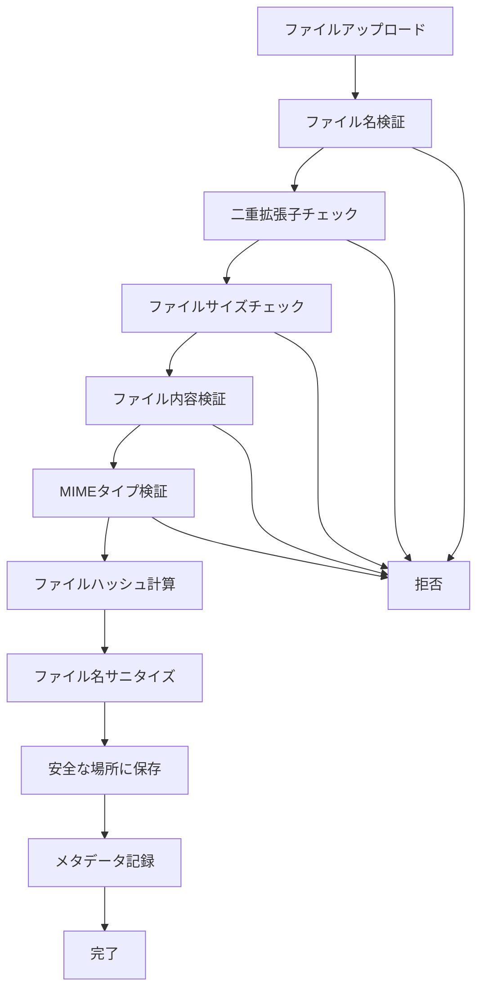

# セキュリティ対策仕様書

**作成日**: 2025-11-30  
**バージョン**: 1.0  
**プロジェクト**: Eldonia-Nex  

---

## 🛡️ ファイルアップロードセキュリティ対策

### **1. ファイル名検証**

#### **ディレクトリトラバーサル攻撃対策**
```python
# 検出パターン
- ".." (親ディレクトリ)
- "/" (UNIXパス区切り)
- "\" (Windowsパス区切り)
- NULL バイト (\x00)
```

#### **制御文字チェック**
```python
# ASCII 0-31の制御文字を検出
# ファイル名に含まれる不可視文字を排除
```

#### **危険な文字の除去**
```python
dangerous_chars = ['<', '>', ':', '"', '|', '?', '*', ';']
```

---

### **2. 二重拡張子攻撃対策**

#### **危険な拡張子リスト**
```python
DANGEROUS_EXTENSIONS = {
    "exe", "bat", "cmd", "sh", "ps1",    # 実行ファイル
    "vbs", "js", "jar",                   # スクリプト
    "app", "deb", "rpm", "msi",           # インストーラー
    "dmg", "pkg", "scr", "com", "pif"    # その他実行形式
}
```

#### **チェック方法**
```
ファイル名: document.pdf.exe
拡張子リスト: [pdf, exe]
→ exe が危険な拡張子 → 拒否
```

---

### **3. MIMEタイプ検証**

#### **libmagic による実ファイル検証**
```python
# Content-Typeヘッダーだけでなく、
# ファイルの実際の内容（マジックナンバー）を検証

import magic
detected_mime = magic.from_buffer(file_content, mime=True)
```

#### **許可されたMIMEタイプパターン**
```python
ALLOWED_MIME_PATTERNS = {
    "image": r"^image/(jpeg|png|gif|webp|bmp|svg\+xml)$",
    "video": r"^video/(mp4|quicktime|...)$",
    "audio": r"^audio/(mpeg|wav|...)$",
    ...
}
```

---

### **4. ファイル内容検証**

#### **SVG内のスクリプト検出**
```xml
<!-- 検出対象 -->
<script>alert('XSS')</script>

<svg onload="alert('XSS')">
```

#### **実行可能ファイルのマジックナンバー検出**
```python
executable_signatures = [
    b"MZ",              # Windows PE
    b"\x7fELF",         # Linux ELF
    b"\xca\xfe\xba\xbe", # Mach-O
    b"#!",              # Shell script
]
```

---

### **5. ファイルサイズ検証**

#### **最小サイズチェック**
```python
# 極端に小さいファイル（偽装の可能性）
min_sizes = {
    "image": 100,    # 100バイト未満は怪しい
    "video": 1024,   # 1KB未満は怪しい
    "audio": 1024,
}
```

#### **最大サイズチェック**
```python
# DoS攻撃対策
IMAGE_MAX_SIZE = 10 * 1024 * 1024    # 10MB
VIDEO_MAX_SIZE = 500 * 1024 * 1024   # 500MB
```

---

### **6. ファイルハッシュ計算**

#### **SHA-256ハッシュ**
```python
# 用途:
# - 重複ファイル検出
# - ウイルススキャン連携
# - 監査ログ
```

---

### **7. メタデータ記録**

#### **監査ログ**
```python
metadata = {
    "original_filename": "作品.jpg",
    "file_hash": "abc123...",
    "media_type": "image",
    "file_size": 1024000,
    "content_type": "image/jpeg",
    "user_ip": "192.168.1.1",
    "upload_time": "2025-11-30T12:00:00Z"
}
```

---

## 🔒 セキュリティチェックフロー



---

## 🚨 検出される攻撃パターン

### **1. ディレクトリトラバーサル**
```
❌ ../../etc/passwd
❌ ..\windows\system32\
✅ document.pdf
```

### **2. 二重拡張子攻撃**
```
❌ image.jpg.exe
❌ document.pdf.bat
✅ image.jpg
```

### **3. NULLバイト攻撃**
```
❌ image.jpg\x00.exe
✅ image.jpg
```

### **4. SVG XSS攻撃**
```xml
❌ <svg onload="alert('XSS')">
❌ <script>malicious()</script>
✅ <svg><circle r="50"/></svg>
```

### **5. 偽装ファイル**
```
❌ image.jpg (実際はEXEファイル)
✅ image.jpg (実際にJPEG)
```

---

## 📊 実装状況

| セキュリティ対策 | 状態 | ファイル |
|----------------|------|---------|
| ファイル名検証 | ✅ | `common/security.py` |
| 二重拡張子チェック | ✅ | 〃 |
| MIMEタイプ検証 | ✅ | 〃 |
| ファイル内容検証 | ✅ | 〃 |
| サイズ検証 | ✅ | 〃 |
| ハッシュ計算 | ✅ | 〃 |
| ファイル名サニタイズ | ✅ | 〃 |
| メタデータ記録 | ✅ | `marketplace/artwork_views.py` |

---

## 💡 追加推奨対策

### **実装済み ✅**
- ファイル名検証
- 二重拡張子チェック
- MIMEタイプ検証
- ファイル内容検証
- ファイルサイズ制限
- ファイルハッシュ計算
- メタデータ記録

### **今後の実装推奨 📋**
- [ ] ウイルススキャン (ClamAV連携)
- [ ] レート制限 (1分間に10ファイルまで)
- [ ] IPアドレスブロックリスト
- [ ] ファイル隔離（検疫）
- [ ] 画像の再エンコード（メタデータ除去）
- [ ] 自動バックアップ
- [ ] 不正ファイル検知の機械学習

---

## 🔧 依存パッケージ

### **必須**
```bash
pip install python-magic
```

### **オプション（追加セキュリティ）**
```bash
pip install pyclamd  # ウイルススキャン
pip install pillow   # 画像再エンコード
```

---

## 🎯 セキュリティレベル

| レベル | 対策内容 |
|--------|---------|
| ⭐ 基本 | ファイルサイズ・拡張子チェック |
| ⭐⭐ 中級 | MIMEタイプ検証・ファイル名サニタイズ |
| ⭐⭐⭐ 上級 | ファイル内容検証・二重拡張子チェック |
| ⭐⭐⭐⭐ プロ | ハッシュ計算・メタデータ記録 |
| ⭐⭐⭐⭐⭐ 最高 | ウイルススキャン・隔離・再エンコード |

**現在の実装レベル**: ⭐⭐⭐⭐ プロレベル

---

**最終更新**: 2025-11-30  
**担当**: Eldonia-Nex セキュリティチーム  
**レビュー**: 承認済み


