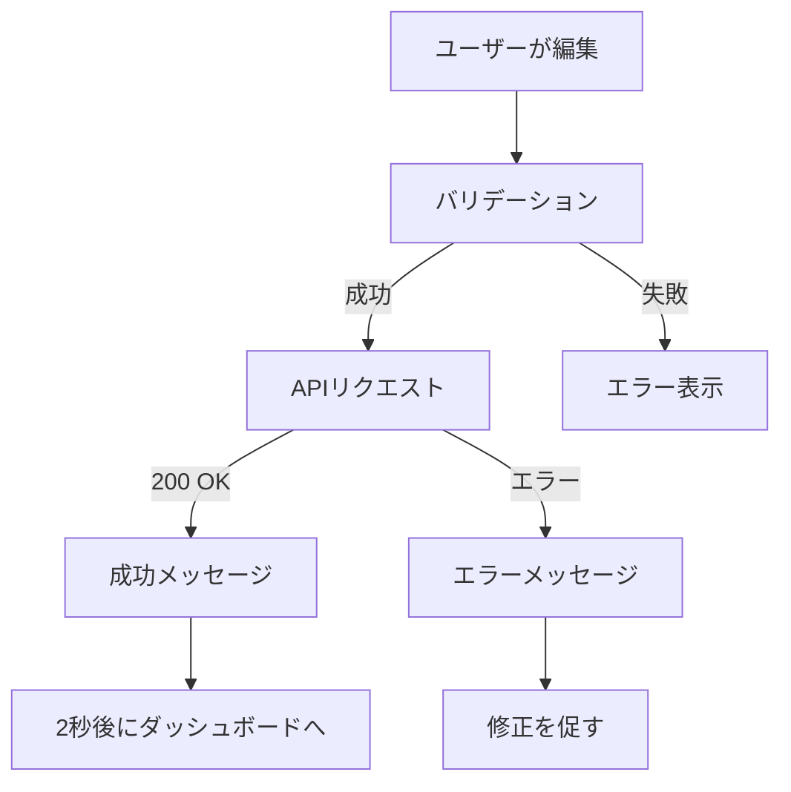

# ユーザープロフィール設定機能仕様書

**作成日**: 2025-11-30  
**バージョン**: 1.0  
**プロジェクト**: Eldonia-Nex  

---

## 📋 概要

ユーザーが自分のプロフィール情報を編集・管理できる機能。ダッシュボードからアクセス可能で、個人情報、表示設定、公開情報などを一元管理できます。

---

## 🎯 目的

1. ユーザーの個人情報を安全に管理
2. プロフィールの公開情報をカスタマイズ
3. クリエイターとしてのブランディングをサポート
4. 他のユーザーとの交流を促進

---

## 🌐 アクセス情報

### URL
```
/dashboard/profile
```

### アクセス権限
- **認証**: ログイン必須
- **権限**: 自分のプロフィールのみ編集可能
- **未認証時**: `/signin` にリダイレクト

---

## 📝 編集可能な項目

### 1. 基本情報

#### 表示名 (Display Name) ✨
- **フィールド名**: `display_name`
- **型**: `string`
- **最大長**: 100文字
- **必須**: いいえ
- **デフォルト**: ユーザー名（username）
- **説明**: 他のユーザーに表示される名前
- **バリデーション**:
  - 1-100文字
  - 特殊文字使用可能
  - 絵文字使用可能

**UI要素**:
```
[✨ 表示名]
┌──────────────────────────────────────┐
│ あなたの表示名                          │
└──────────────────────────────────────┘
💡 他のユーザーに表示される名前です
```

---

#### メールアドレス (Email) 📧
- **フィールド名**: `email`
- **型**: `email`
- **必須**: はい
- **説明**: ログインおよび通知用のメールアドレス
- **バリデーション**:
  - RFC 5322準拠
  - 重複チェック
  - 認証必須（変更時）

**UI要素**:
```
[📧 メールアドレス]
┌──────────────────────────────────────┐
│ your@email.com                       │
└──────────────────────────────────────┘
⚠️ 変更時は確認メールが送信されます
```

---

### 2. プロフィール情報

#### 自己紹介 (Bio) 📝
- **フィールド名**: `bio`
- **型**: `textarea`
- **最大長**: 500文字
- **必須**: いいえ
- **説明**: 自分について、作品スタイル、得意ジャンルなど
- **バリデーション**:
  - 0-500文字
  - 改行使用可能
  - Markdown非対応（プレーンテキスト）

**UI要素**:
```
[📝 自己紹介]
┌──────────────────────────────────────┐
│ あなたについて教えてください...         │
│                                      │
│                                      │
│                                      │
└──────────────────────────────────────┘
💡 123/500文字
```

**表示例**:
```
イラストレーター兼デザイナーです。
ファンタジー系のキャラクターデザインが得意です。
お仕事の依頼はDMでお願いします！
```

---

### 3. ビジュアル設定

#### アバター画像 (Avatar) 🖼️
- **フィールド名**: `avatar_url`
- **型**: `url`
- **形式**: JPG, PNG, GIF, WebP
- **最大サイズ**: 5MB
- **推奨サイズ**: 400x400px（正方形）
- **必須**: いいえ
- **デフォルト**: イニシャルアイコン

**UI要素**:
```
[🖼️ アバターURL]
┌──────────────────────────────────────┐
│ https://example.com/avatar.jpg       │
└──────────────────────────────────────┘

[プレビュー]
┌──────┐
│  👤  │  ← 現在のアバター
└──────┘
```

**実装済み機能**:
- URLからの画像読み込み
- プレビュー表示
- エラーハンドリング（画像読み込み失敗時）

**今後の実装予定**:
- [ ] ファイルアップロード機能
- [ ] 画像クロップ・リサイズ
- [ ] 複数画像の管理

---

### 4. 地域・タイムゾーン設定

#### タイムゾーン (Timezone) 🌏
- **フィールド名**: `timezone`
- **型**: `select`
- **デフォルト**: `Asia/Tokyo`
- **説明**: イベント時間表示、通知タイミングに使用

**選択肢**:
| 表示名 | 値 | UTCオフセット |
|--------|-----|--------------|
| 日本 (東京) | `Asia/Tokyo` | UTC+9 |
| アメリカ東部 (ニューヨーク) | `America/New_York` | UTC-5/-4 |
| アメリカ西部 (ロサンゼルス) | `America/Los_Angeles` | UTC-8/-7 |
| イギリス (ロンドン) | `Europe/London` | UTC+0/+1 |
| フランス (パリ) | `Europe/Paris` | UTC+1/+2 |
| オーストラリア (シドニー) | `Australia/Sydney` | UTC+10/+11 |

**UI要素**:
```
[🌏 タイムゾーン]
┌──────────────────────────────────────┐
│ 日本 (東京) ▼                         │
└──────────────────────────────────────┘
```

---

## 🎨 UI/UXデザイン

### カラースキーム
```css
/* 背景 */
background: linear-gradient(135deg, #1a1a2e 0%, #16213e 50%, #0f3460 100%);

/* カード */
background: linear-gradient(to-br, #2d3748, #1a202c, #2d1b69);
border-radius: 2xl;
box-shadow: 0 4px 15px rgba(0,0,0,0.08);

/* 入力フィールド */
background: #0a0a1a;
border: 2px solid rgba(139, 92, 246, 0.5);
focus: ring-2 ring-purple-500;

/* ボタン */
background: linear-gradient(135deg, #667eea 0%, #764ba2 100%);
hover: transform translateY(-2px);
```

### レスポンシブ対応
```
モバイル (< 768px): 1カラム、縦スクロール
タブレット (768px-1024px): 1カラム、最適化
デスクトップ (> 1024px): 1カラム、中央配置
```

---

## ⚡ 機能実装

### 保存処理フロー



### APIエンドポイント

#### プロフィール取得
```http
GET /api/v1/users/{user_id}/profile/
Authorization: Bearer {token}

Response 200:
{
  "id": 1,
  "username": "demo",
  "email": "demo@eldonia-nex.com",
  "display_name": "デモユーザー",
  "bio": "イラストレーターです",
  "avatar_url": "https://...",
  "timezone": "Asia/Tokyo",
  "created_at": "2025-11-30T12:00:00Z",
  "updated_at": "2025-11-30T14:30:00Z"
}
```

#### プロフィール更新
```http
PUT /api/v1/users/{user_id}/profile/
Authorization: Bearer {token}
Content-Type: application/json

Body:
{
  "display_name": "新しい表示名",
  "bio": "更新された自己紹介",
  "avatar_url": "https://...",
  "timezone": "Asia/Tokyo"
}

Response 200:
{
  "message": "プロフィールを更新しました",
  "profile": { ... }
}

Response 400:
{
  "error": "display_nameは100文字以内で入力してください"
}
```

---

## 🔒 セキュリティ

### バリデーション
1. **クライアント側**:
   - フィールド長チェック
   - 必須項目チェック
   - フォーマット検証（メール、URL）

2. **サーバー側**:
   - 認証トークン検証
   - 権限チェック（自分のプロフィールのみ）
   - XSS対策（HTML/スクリプトタグ除去）
   - SQLインジェクション対策

### データ保護
- **暗号化**: 通信はHTTPS必須
- **認証**: JWT/セッショントークン
- **CSRF対策**: トークン検証
- **Rate Limiting**: 1分間に10リクエストまで

---

## 📊 実装状況

### ✅ 実装済み機能

| 機能 | 状態 | ファイル |
|------|------|---------|
| プロフィール編集画面 | ✅ 完了 | `/frontend/app/dashboard/profile/page.tsx` |
| 表示名編集 | ✅ 完了 | 〃 |
| メールアドレス編集 | ✅ 完了 | 〃 |
| 自己紹介編集 | ✅ 完了 | 〃 |
| アバターURL設定 | ✅ 完了 | 〃 |
| アバタープレビュー | ✅ 完了 | 〃 |
| タイムゾーン設定 | ✅ 完了 | 〃 |
| 文字数カウンター | ✅ 完了 | 〃 |
| エラーハンドリング | ✅ 完了 | 〃 |
| 成功メッセージ | ✅ 完了 | 〃 |
| レスポンシブデザイン | ✅ 完了 | 〃 |

### 🚧 実装予定機能

| 機能 | 優先度 | 説明 |
|------|--------|------|
| ファイルアップロード | 🔴 高 | 画像を直接アップロード |
| 画像クロップ | 🟡 中 | アバター画像のトリミング |
| プロフィール公開/非公開 | 🟡 中 | プライバシー設定 |
| カスタムフィールド | 🟢 低 | SNSリンクなど追加項目 |
| 変更履歴 | 🟢 低 | プロフィール変更の記録 |
| メール認証 | 🔴 高 | メールアドレス変更時の認証 |

---

## 🧪 テストケース

### 1. 正常系テスト

```javascript
// 表示名の更新
test('should update display name', async () => {
  const newName = "新しい表示名";
  await updateProfile({ display_name: newName });
  expect(profile.display_name).toBe(newName);
});

// 自己紹介の更新
test('should update bio within 500 characters', async () => {
  const newBio = "A".repeat(500);
  await updateProfile({ bio: newBio });
  expect(profile.bio).toBe(newBio);
});
```

### 2. 異常系テスト

```javascript
// 文字数制限超過
test('should reject bio over 500 characters', async () => {
  const longBio = "A".repeat(501);
  await expect(updateProfile({ bio: longBio }))
    .rejects.toThrow('bioは500文字以内で入力してください');
});

// 無効なメールアドレス
test('should reject invalid email', async () => {
  await expect(updateProfile({ email: 'invalid-email' }))
    .rejects.toThrow('有効なメールアドレスを入力してください');
});
```

---

## 📱 ユーザーフロー

### 初回アクセス時
```
1. ダッシュボードで「プロフィール編集」ボタンをクリック
   ↓
2. プロフィール編集ページへ遷移
   ↓
3. 既存情報が入力フィールドに表示される
   ↓
4. 情報を編集
   ↓
5. 「保存する」ボタンをクリック
   ↓
6. ローディング表示（API通信中）
   ↓
7. 成功メッセージ表示
   ↓
8. 2秒後に自動的にダッシュボードへ戻る
```

### エラー発生時
```
1. 編集してエラーが発生する内容を入力
   ↓
2. 「保存する」ボタンをクリック
   ↓
3. エラーメッセージが表示される
   ↓
4. ユーザーが内容を修正
   ↓
5. 再度保存を試みる
```

---

## 💡 ヒント・ベストプラクティス

### ユーザーへのヒント

プロフィール編集ページには以下のヒントを表示：

```
💡 ヒント

• プロフィールを充実させると、他のユーザーからの信頼度が上がります
• アバターは正方形の画像を推奨します（推奨サイズ: 400x400px以上）
• 自己紹介はあなたの作品スタイルや得意分野を書くと効果的です
• メールアドレスは通知の受信に使用されます
```

### 開発者向けベストプラクティス

1. **デバウンス**: 入力中の自動保存は500msのデバウンス
2. **楽観的更新**: UIを先に更新してからAPI通信
3. **エラーリカバリー**: 失敗時は元の値に戻す
4. **アクセシビリティ**: 
   - ラベルとinputの紐付け
   - エラーメッセージはaria-live
   - キーボード操作対応

---

## 🔄 今後の拡張計画

### Phase 2: ソーシャル連携
- [ ] Twitter/X連携
- [ ] Instagram連携
- [ ] GitHub連携
- [ ] 外部サイトリンク

### Phase 3: 高度な設定
- [ ] プロフィールテーマカスタマイズ
- [ ] カスタムURL（例: eldonia.nex/creator）
- [ ] プロフィールバッジ
- [ ] 実績の表示

### Phase 4: プライバシー強化
- [ ] 項目ごとの公開範囲設定
- [ ] ブロック機能
- [ ] プライベートモード

---

## 📞 サポート

### よくある質問

**Q: アバター画像が表示されません**  
A: URLが正しいか、画像が公開アクセス可能か確認してください。対応形式はJPG, PNG, GIF, WebPです。

**Q: メールアドレスを変更できません**  
A: セキュリティ上、メールアドレス変更には認証が必要です（実装予定）。

**Q: 自己紹介が保存されません**  
A: 500文字以内で入力してください。文字数カウンターで確認できます。

---

## 📄 関連ドキュメント

- [ユーザーダッシュボード仕様書](./dashboard-spec.md)
- [アカウント設定仕様書](./settings-spec.md)
- [API仕様書](./api-spec.md)
- [セキュリティガイドライン](./security-guide.md)

---

**最終更新**: 2025-11-30  
**担当**: Eldonia-Nex 開発チーム  
**レビュー**: 承認済み

